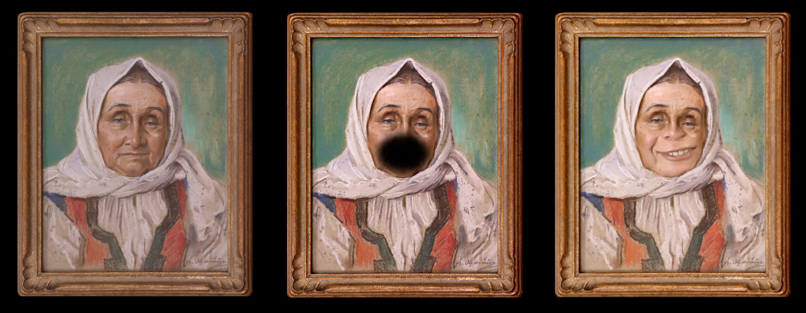
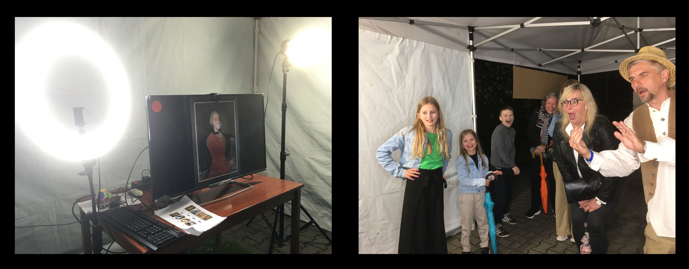
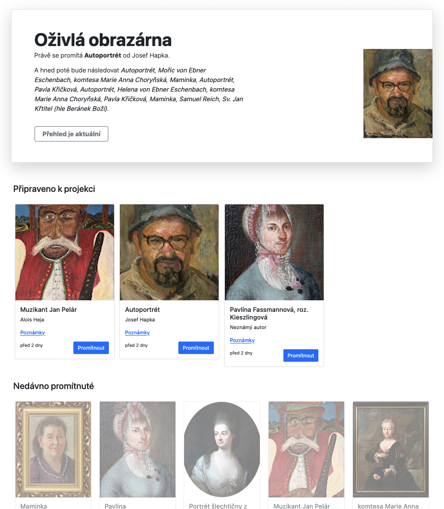

Ozivla obrazarna byl projekt [Vrtule](http://zlatesipy.cz/vrtule) a [Muzea
regionu Valassko](http://muzeumvalassko.cz), kterym se prezentovali na akci
[Meziricska muzejni noc 2022](https://mmn.kzvalmez.cz/).

# O co slo?

Muzeum vybralo ze svych sbirek 18 obrazu, ktere tematicky souvisi s nasim
regionem.

Kazdy obraz jsme vyfotili a upravili v pocitaci tak, aby v miste, kde je pusa
byla pruhledna dira. Do ni jsme nasledne naklicovali zaber z videokamery.
"Herci" z rad verejnosti tak meli moznost ozivit kratkym skecem nekterou z
historickych postav.

Vysledne video se pak s patricnou pompou promitalo na stenu Vrtule.

# Prubeh akce

Nahravani a projekce probihaly na dvou ruznych mistech.

Nahravaci studio jsme umistili ven do party stanu s pudrysem 3x6 metru. Uvnitr
byla velkoplosna televize, kamera a lampy. Pro kazdeho navstevnika pocitac
nahodne vybral jeden z obrazu, promitl ho na televizi a pockal, az se "herci"
spravne napozicuji a pripravi. Pote nasnimal 7 vterin zaznamu a odeslal jej
k dalsimu zpracovani.

Projekce probihala nejprve uvnitr Vrtule, protoze Meziricka muzejni noc
zacinala v 19 hodin a venku bylo na projektor jeste moc svetla. Lidi, kteri
prosli nahravacim studiem nejprve s pomoci obsluhy dohledali svou nahravku a
pote ji ve forme kratkeho filmu shledli na obrazovce televize (spolecne s
odbornym vykladem).

Po 21 hodine jsme se pak presunuli ven do dalsiho party stanu (tentokrat 
3x3m) a pokracovali v projekci na stenu domu.

Lo-fi zaznam z projekce:

# Technicke reseni

Nahravaci studio bylo realizovano s pomoci [Raspberry Pi
4](https://www.raspberrypi.com/products/raspberry-pi-4-model-b/) a [oficialni
kamery](https://www.raspberrypi.com/products/camera-module-v2/) pro tento
mikropocitac. Software na nem byl napsan v jazyce Python za vyuziti knihoven
[PyGame](https://www.pygame.org/news) a
[picamera](https://picamera.readthedocs.io/en/release-1.13/), viz adresar
[`obrazarna-klient`](./obrazarna-klient/).

Data ze studia (videonahravky) byly odeslany na interni server Vrtule, do
aplikace napsane v jazyce Python s vyuzitim frameworku
[Django](https://www.djangoproject.com/). Tato cast plnila nekolik klicovych
funkci:

* obsahovala databazi obrazu z obrazarny, hudebnich podkresu, a zaznamy
  jednotlivych vystupu (nahravek ze studia)
* nad vsemi daty poskytovala RESTove API rozhrani
* generovala jednoduche administrativni rozhrani s vypisem nahravek ze studia,
  ze ktereho se nasledne posilala videa do projektoru
* generovala prezentaci v upravenem frameworku
  [reveal.js](https://revealjs.com/) (ktery pak vypadal jako kratky film s
  titulkama)

Serverova cast obrazarny je k nalezeni v adresari
[`obrazarna-server`](./obrazarna-server/).

Posledni komponentou byl notebook pripojeny k televizi (a posleze projektoru),
pricemz na obrazovce notebooku byla ve webovem prohlizeci administratorska
aplikace pro vyber obrazu k projekci, a na televizi druhy prohlizec ve
fullscreen rezimu, ktery promital jednotlive snimky.

Poznamka: vsecko fungovalo prekvapive dobre, nicmene nedostatek casu a lidi se
odrazil v kvalite softwaroveho reseni. Na prepsani ale uz nezbyva sil, takze
pokud se budete hrabat ve zdrojovych kodech, preju hodne stesti a trpelivosti.

# Data

Vsechny promitane obrazy pochazi ze sbirek [Muzea regionu
Valassko](http://muzeumvalassko.cz), ktere pripravila a doplnila faktickymi
informacemi Kamila Valouskova.

Autory hudebnich podkresu jsou Andrea Tomecku a Lada Krajca.

Autorem software je Michal Valousek.

Data jsou k nalezi v adresari [`data`](./data/).

**Upozorneni: obrazovy a zvukovy material byl vytvoren vyhradne pro akci
Meziricska muzejni noc 2022 a jeho prepouziti je mozne pouze s vyhradnim
svolenim autoru (Muzea regionu Valassko v pripade fotografii a textu k obrazum,
Andrei Tomecku a Ladi Krajci v pripade hudebnich doprovodu). Se softwarem si
muzete delat co chcete.**

Priprava celeho projektu zabrala zhruba mesic (po vecerech).
