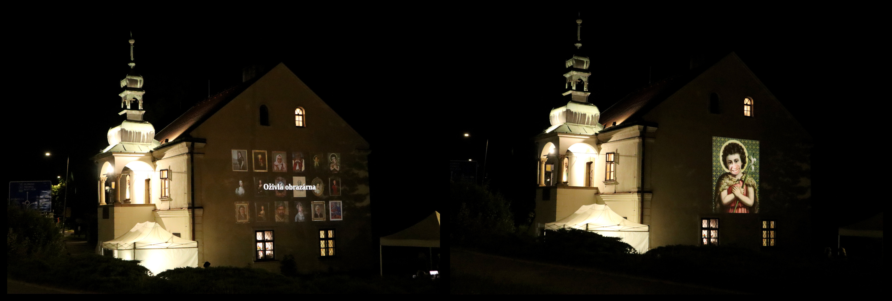
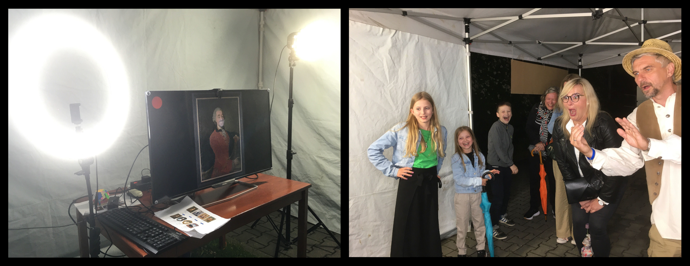

Ozivla obrazarna byl projekt [Vrtule](http://zlatesipy.cz/vrtule) a [Muzea
regionu Valassko](http://muzeumvalassko.cz), kterym se prezentovali na akci
[Meziricska muzejni noc 2022](https://mmn.kzvalmez.cz/).

# O co slo?

Muzeum vybralo ze svych sbirek 18 obrazu, ktere tematicky souvisi s nasim
regionem.

Kazdy obraz jsme vyfotili a upravili v pocitaci tak, aby v miste, kde je pusa
byla pruhledna dira. Do ni jsme nasledne naklicovali zaber z videokamery.
"Herci" z rad verejnosti tak meli moznost ozivit kratkym skecem nekterou z
historickych postav.

Vysledne video se pak s patricnou pompou promitalo na stenu Vrtule.

Pro lepsi predstavu jeste kratke video:

# Prubeh akce

Nahravani a projekce probihaly na dvou ruznych mistech.

Nahravaci studio jsme umistili ven do party stanu s pudorysem 3x6 metru. Uvnitr
byla televize, kamera a lampy. Pro kazdeho navstevnika pocitac
nahodne vybral jeden z obrazu, promitl ho na televizi a pockal, az se "herci"
spravne napozicuji a pripravi. Pote nasnimal 7 vterin zaznamu a odeslal jej
k dalsimu zpracovani.

Projekce probihala nejprve uvnitr Vrtule, protoze Meziricka muzejni noc
zacinala v 19 hodin a venku bylo na projektor jeste moc svetla. Lidi, kteri
prosli nahravacim studiem s pomoci obsluhy dohledali svou nahravku a
pote ji ve forme kratkeho filmu shledli na obrazovce televize (spolecne s
odbornym vykladem).

Ukazka administrace nahravek:

Po 21 hodine jsme se pak presunuli ven do dalsiho party stanu (tentokrat 
3x3m) a pokracovali v projekci na stenu domu.

Lo-fi zaznam z projekce:

# Technicke reseni

Nahravaci studio bylo realizovano s pomoci [Raspberry Pi
4](https://www.raspberrypi.com/products/raspberry-pi-4-model-b/) a [oficialni
kamery](https://www.raspberrypi.com/products/camera-module-v2/) pro tento
mikropocitac. Software na nem byl napsan v jazyce Python za vyuziti knihoven
[PyGame](https://www.pygame.org/news) a
[picamera](https://picamera.readthedocs.io/en/release-1.13/), viz adresar
[`obrazarna-klient`](./obrazarna-klient/).

Data ze studia (videonahravky) byly odeslany na interni server Vrtule, do
aplikace napsane v jazyce Python s vyuzitim frameworku
[Django](https://www.djangoproject.com/). Tato cast plnila nekolik klicovych
funkci:

* obsahovala databazi obrazu z obrazarny, hudebnich podkresu, a zaznamy
  jednotlivych vystupu (nahravek ze studia)
* nad vsemi daty poskytovala RESTove API rozhrani
* generovala jednoduche administrativni rozhrani s vypisem nahravek ze studia,
  ze ktereho se nasledne posilala videa do projektoru
* generovala prezentaci v upravenem frameworku
  [reveal.js](https://revealjs.com/) (ktery pak vypadal jako kratky film s
  titulkama)

Serverova cast obrazarny je k nalezeni v adresari
[`obrazarna-server`](./obrazarna-server/).

Posledni komponentou byl notebook pripojeny k televizi (a posleze projektoru),
pricemz na obrazovce notebooku byla ve webovem prohlizeci administratorska
aplikace pro vyber obrazu k projekci, a na televizi druhy prohlizec ve
fullscreen rezimu, ktery promital jednotlive snimky.

Poznamka: vsecko fungovalo prekvapive dobre, nicmene nedostatek casu a lidi se
odrazil v kvalite softwaroveho reseni. Na prepsani ale uz nezbyva sil, takze
pokud se budete hrabat ve zdrojovych kodech, preju hodne stesti a trpelivosti.

# Data

Vsechny promitane obrazy pochazi ze sbirek [Muzea regionu
Valassko](http://muzeumvalassko.cz), ktere pripravila a doplnila faktickymi
informacemi Kamila Valouskova.

Autory hudebnich podkresu jsou Andrea Tomecku a Lada Krajca.

Autorem software je Michal Valousek.

Data jsou k nalezi v adresari [`data`](./data/).

**Upozorneni: obrazovy a zvukovy material byl vytvoren vyhradne pro akci
Meziricska muzejni noc 2022 a jeho prepouziti je mozne pouze s vyhradnim
svolenim autoru (Muzea regionu Valassko v pripade fotografii a textu k obrazum,
Andrei Tomecku a Ladi Krajci v pripade hudebnich doprovodu). Se softwarem si
muzete delat co chcete.**

# Poznamky

* Priprava celeho projektu zabrala zhruba mesic (po vecerech)
* Puvodne jsme pocitali s tim, ze s celou akci zacnem az po 21 hodine, kdy
  uz bude venku dostatecna tma na projekci. Na posledni chvili jsme ale
  zmenili plany, protoze nam prislo skoda, ze lidi kteri budou chodit uz od
  19 hodin (hlavne rodiny s detma) by o celou taskarici prisli. Proto
  jsme v prvni polovine akce promitali vysledne klipy na TV.
* Promitani na TV melo i dalsi vyhodu -- probihalo v mensim prostoru (horni
  vstup do Vrtule) a videa bylo mozne v uvodni titulkove casti lepe komentovat
  (co za historickou postavu lidi vidi, kdo byl autorem a jaky byl jeho osud,
  apod). Venku se to uz delalo hur, protoze lidi byli dal a muselo se hodne
  kricet.
* Trochu jsme se bali, ze bez zvuku (jakoze original zvuku ktery by vytvareli
  herci) to nebude ono. Nicemu to ale nevadilo, s hudebnim podkresem, a v
  podobe kratkeho filmu se to ztratilo.
* Rozdeleni na 2 mista (nahravaci studio, projekce) byl dobry tah; kdyby
  obe mista byly blizko sebe, lidi by se rusili
* Na oziveni technikalii jsem si vyhradil ~2 hodiny pred zacatkem akce,
  a bylo to malo. Veci sice fungovaly jak mely, ale kvuli silnym stenam
  Vrtule a slabemu Wifi signalu jsme museli improvizovat. Do studia byl
  priveden kabel a kvuli projekci jsme vyvesili jeden z wifi routeru do
  okna (castecne byl problem i v tom, ze ikdyz na miste byly 4 ruzne pocitace,
  zadny z nich nesel zaroven propojit s HDMI a ethernet kabelem; dongly
  jsme meli, ale ruzne nefungovaly).
* Barevne nastaveni projektoru je treba delat za idealnich podminek, tj.
  nekdy kolem 22 hodiny. My jsme ho provedli mezi 20:30 a 21 hodinou a
  promitane videa byly ze zacatku pekne prepalene (dusledek toho ze jsme
  zbytecne moc vytahli kontrast a jas, aby slo neco na stene videt)
* Sestrih z akce: [cast 1](https://youtu.be/_uVQq2S1n8M), [cast
  2](https://youtu.be/M9oSTmewnBo)
* Nahravani na kameru se realizovalo pres klasickou klavesnici, mezernikem.
  Je to ale velke hamatne heblo, ktere bylo polozene na stolku a nekdy
  po silnejsim zmacknuti klavesy se kamera mirne rozechvela (a zaznam pak
  byl roztrepany); priste je treba dat klavesnici jinde a idealne ji nahradit
  necim mensim
