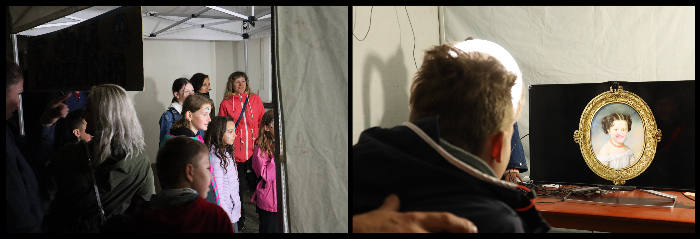

Software pro nahravaci studio Ozivle obrazarny.



S jeho pomoci se na obrazovce objevi vycet vsech obrazu, ktere Ozivla obrazarna nabizi.
Po zmacknuti mezerniku na klavesnici dojde k nahodnemu vyberu nektereho z nich a zobrazeni
pres celou obrazovku. Navstevnik ma pak cas na to, aby si nasel idealni pozici, tj. aby
svou tvar co nejlepe napasoval do mista, kde je v obraze dira. Jakmile je pripraven,
obsluha znovu zmackne mezernik a system poridi cca 7 vterinovy video zaznam. Vysledna
nahravka je spolecne s informaci o nahodne vybranem hudebnim podkresu nahrana na server,
a na obrazovce se opet objevi prehled obrazu.

Prubeh jedne seance ze studia:

[](http://www.youtube.com/watch?v=enArSrpfjno)

# Instalace

Aplikace je urcena pro Raspberry Pi a je primo zavisla na knihovne pro oficialni RPi kamery.
Z tohoto duvodu pravdepodobne nepujde rozjet na jinem HW.

Postup:

* Pripravit HW: Raspberry Pi 4 s pripojenou ofiko kamerou
* Nainstalovat 32-bitovou verzi operacniho systemu "Raspberry Pi OS with
  desktop" (Obrazarna jela na verzi `2022-04-04-raspios-bullseye-armhf`)
* Projit oficialni instalacni proces po prvnim spusteni, v ramci ktereho je
  treba updatnout system
* Po restartu spustit `raspi-config` a povolit "Camera interface" (a SSH; pro chod
  studia neni nutne, ale muze se hodit)
* Nainstalovat potrebne systemove balicky: `apt-get install -y vim libsdl2-image-2.0-0 libsdl2-mixer-2.0-0 libsdl2-ttf-2.0-0`
* Naklonovat dovnitr RPi tento GitHub projekt, prepnout se do adresare
  `obrazarna-klient` a spustit `pip install -e .`

# Konfigurace

V souboru [`obrazarna_klient/config.py`](./obrazarna_klient/config.py) je treba upravit
hodnotu `API_DOMAIN` (musi smerovat na spusteny [`obrazarna-server`](../obrazarna-server/).

Server musi obsahovat relevatni data, tj. zaznamy s obrazy a doprovodnou muzikou.

Muze se stat, ze po spusteni obrazarny budou barvy na obrazovce "vyblite" (cerna neni cerna,
ale tmave seda). Pomuze pridat do souboru `/boot/config.txt` nasledujici radek a RPi restartovat:

```
# RGB full (0-255)
hdmi_pixel_encoding=2
```

[Ofiko dokumentace](https://www.raspberrypi.com/documentation/computers/config_txt.html#hdmi_pixel_encoding).

# Spusteni

```bash
python3 obrazarna.py
```

# Technicke detaily

Studio je postavene na dvou knihovnach:

* [PyGame](https://www.pygame.org/)  
  V originale slouzi pro vyvoj jednoduchych her, poskytuje low-level API na SDL
  k obrazovce, zvuku, periferiim. Obrazarna toutu knihovnou pokryva vse co se deje
  na obrazovce s vyjimkou samotneho nahravani videa.
* [Picamera](https://picamera.readthedocs.io/en/release-1.13/)  
  Ovladani oficialni kamery k RPi. Obrazarna kameru iniciuje, pusti preview
  videa na monitor, vlozi nad vrstvu videa PNG obrazek s pruhlednosti a na pokyn
  nahraje video do souboru. Bohuzel, overlay vrstva se nestava soucasti nahravky,
  proto je nutny dalsi postprocessing.

S vyvojem her ani knihovnou PyGame moc zkusenosti nemam, stav kodu tomu odpovida.

## Stavy

Aplikace studia je v podstate jednoduchy stavovy stroj:

* `INTRO` -- na obrazovce jsou vykresleny vsechny obrazy, pres ne jezdi kolecko
  "svetla" od obrazu k obrazu, nad tim vsim je napis "Ozivla obrazarna". Po stisku
  mezerniku kolco najede na vybrany obraz.
* `FADEOUT` -- plynule ztraceni napisu "Ozivla obrazarna"
* `ZOOM` -- vybrany obraz se zvetsi na celou obrazovku.
* `PREVIEW` -- tady se predava zezlo knihovne Picamera. Inicializace kamery tak,
  aby se na obrazovce ukazala overlay vrstva obrazu s vyrezanou dirou a pod ni
  preview videa z kamery. Po stisku mezery zacne v levem hornim rohu blikat 
  cervene kolecko a dojde k zaznamenani videa do souboru.
* `UPLOAD` -- odeslani zaznamenaneho videa na server, zobrazeni napisu "Hotovo".

Stav `UPLOAD` prechazi zpet do `INTRO`.

# Poznamky

* Vyvoj studia probihal nejprve na mem pracovnim notebooku a teprve po case
  jsem jej zacal testovat na RPi. A narazil jsem na vykonove problemy. RPi 3
  jsem musel nahradit za RPi 4, a vysledny SW postupne optimalizovat. Nejvetsi
  dopad mela uprava algoritmu, ktera se starala o vykreslovani grafiky na
  obrazovku. Plati: cim mensi plocha se prekresluje, tim lepe
* Ve stavech je binec, jednotlive implementace stavu by mely vracet konstanty
  definovane v nejakem separatnim souboru, ale vraci stringy
* V kodu na par miste natvrdo inicuju parametry knihoven explicitnimi hodnotami,
  namisto abych pouzival konfiguracni hodnoty nactene ze serveru
* Asi by se hodilo neco jako globalni storage, se kterym by jednotlive stavy
  komunikovaly. Ted to mam udelane tak, ze stav A potrebuje pro spusteni
  sadu parametru, a pri prechodu do stavu B ze svych utrob vyexportuje data
  pro inicializaci stavu B. Je to neprijemne, spatne se testuji a vyviji
  stavy ktere jsou hloubeji ve flow.
