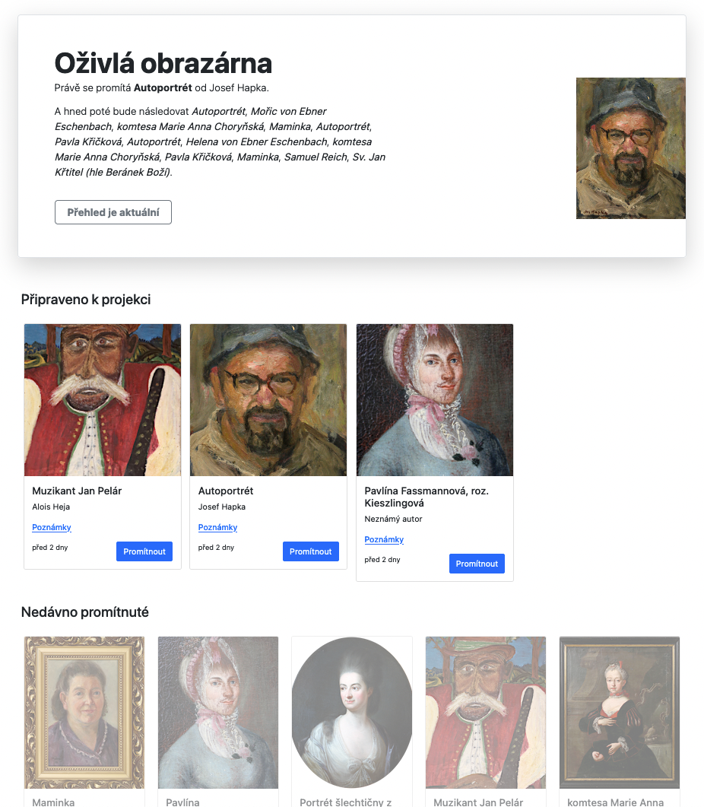
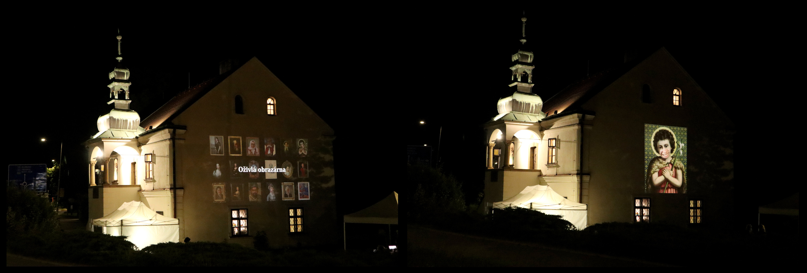

Serverova cast Ozivle obrazarny, do ktere se nahravaly data ze studia
(videonahravky).

Tato cast aplikace je napsana v jazyce Python s vyuzitim frameworku
[Django](https://www.djangoproject.com/).

Funkce:

* obsahovala databazi obrazu z obrazarny, hudebnich podkresu, a zaznamy
  jednotlivych vystupu (nahravek ze studia)
* nad vsemi daty poskytovala RESTove API rozhrani
* generovala jednoduche administrativni rozhrani s vypisem nahravek ze studia,
  ze ktereho se nasledne posilala videa do projektoru
* generovala prezentaci v upravenem frameworku
  [reveal.js](https://revealjs.com/) (ktery pak vypadal jako kratky film s
  titulkama)


Obsah:

* [Instalace](#instalace)
* [Datovy model](#datovy-model)
* [REST API](#rest-api)
    * [Rozcestnik (`GET /api/`)](#rozcestnik-get-api)
    * [Rozmery (`GET /api/pictures/dimensions/`)](#rozmery-get-apipicturesdimensions)
    * [Obrazy (`GET /api/pictures/`)](#obrazy-get-apipictures)
    * [Hudebni podkres (`GET /api/accompaniments/`)](#hudebni-podkres-get-apiaccompaniments)
    * [Performance (`GET /api/performance/`)](#performance-get-apiperformance)
    * [Kontrola, jestli se na server nahralo nejake nove video ze studia (`GET /api/performance/check/?now=1`)](#kontrola-jestli-se-na-server-nahralo-nejake-nove-video-ze-studia-get-apiperformancechecknow1)
    * [Doporuceni na dalsi obraz/hudebni podkres (`GET /api/performance/recommend/`)](#doporuceni-na-dalsi-obrazhudebni-podkres-get-apiperformancerecommend)
    * [Informace o nahravkach pripravenych k projekci (`GET /api/performance/upcomming/`)](#informace-o-nahravkach-pripravenych-k-projekci-get-apiperformanceupcomming)
    * [Vytvoreni nahravky (POST `/api/performance/`)](#vytvoreni-nahravky-post-apiperformance)
    * [Oznaceni zaznamu jako kandidata k projekci (POST `/api/performance/<id>/select/`)](#oznaceni-zaznamu-jako-kandidata-k-projekci-post-apiperformanceidselect)
    * [Oznaceni prehraneho zaznamu (POST `/api/performance/<id>/played/`)](#oznaceni-prehraneho-zaznamu-post-apiperformanceidplayed)
* [Administrace](#administrace)
* [Projekce](#projekce)
* [Zpracovani videa](#zpracovani-videa)

# Instalace

Cely projekt je "zdockerovany", takze jej staci stahnout na pocitac kde bezi
Docker (a `docker-compose`) a spustit:

```bash
docker-compose build
docker-compose up
```

Nastartuji celkem 4 komponenty:

* PostgreSQL databaze
* App (vlastni aplikace zverejnujici endpointy pro api (`/api/`), projekci (`/`) a administraci (`/panel/`))
* Worker (asynchronni processing videa)
* Redis (vyuzity jako broker pro Worker)

V prohlizeci je pak pristupna na adrese `http://localhost:9000`.

# Datovy model

Projekt obsahuje 3 zakladni aplikace:

* [`pictures`](./pictures/) -- databaze obrazu; kazdy zaznam obsahuje informace
  o nazvu obrazu, jeho autorovi, dobe vzniku, technice, umisteni a poznamky pro
  vyklad + dva obrazky (jeden v originalni podobe, druhy realizovany jako
  pruhledna PNG maska, ktera se pokladala jako vrstva pres video)
* [`accompaniments`](./accompaniments/) -- databaze hudebnich podkresu k
  projekci; jednoduchy model obsahujici nazev doprovodu, jejiho autora a
  samotny MP3 soubor
* [`performance`](./performance/) -- hlavni aplikace okolo ktere se vse toci;
  zaznam "performance" predstavuje vystup konkretniho cloveka; propojuje
  nahodne vybrany obraz a podkres s video nahravkou porizenou v nahravacim
  studiu

# REST API

Na adrese `/api/` jsou zpristupnene endpointy pro vsechny 3 modely.

## Rozcestnik (`GET /api/`)

```json
{
    "pictures": "http://192.168.88.2:9000/api/pictures/",
    "performance": "http://192.168.88.2:9000/api/performance/",
    "accompaniments": "http://192.168.88.2:9000/api/accompaniments/"
}
```

## Rozmery (`GET /api/pictures/dimensions/`)

```json
{
    "grid": {
        "width": 6,
        "height": 3,
        "padding": 20
    },
    "cell": {
        "width": 173,
        "height": 200
    },
    "screen": {
        "width": 1280,
        "height": 720
    }
}
```

Konfiguracni parametry pro klientskou cast aplikace (nahravaci studio). Uvadi rozliseni
obrazovky (`screen`), rozmery gridu do ktereho se vykresli obrazy (`grid`) a vypocitane
rozmery jedne bunky gridu (`cell`).

## Obrazy (`GET /api/pictures/`)

```json
{
    "count": 1,
    "next": null,
    "previous": null,
    "results": [
        {
            "id": 37,
            "title": "Antonie Pečivová",
            "author": "Josef Hapka",
            "year": "40. léta 20. století",
            "technique": "olej na plátně",
            "collection": "Sbírka Muzea regionu Valašsko, Valašské Meziříčí",
            "number": "UH3045",
            "notes": "Antonie Pečivová byla manželkou hrachoveckého mlynáře Leopolda Pečivy – jejich mlýn je zachycený v pohledu z okna. Malíř Josef Hapka portrétoval celou rodinu – tato podobizna je z celého souboru nejreprezentativnější.",
            "file": "http://192.168.88.2:9000/files/pictures/UH3045_pecivova_1652113835_495164.jpg",
            "mask": "http://192.168.88.2:9000/files/masks/UH3045_pecivova_1652796181_3317318.png",
            "width": 572,
            "height": 720,
            "grid_width": 159,
            "grid_height": 200,
            "grid_ratio": 0.2777777777777778,
            "created": "2022-05-09T16:30:35.495000Z",
            "modified": "2022-05-17T14:03:01.331000Z"
        }
    ]
}
```

## Hudebni podkres (`GET /api/accompaniments/`)

```json
{
    "count": 1,
    "next": null,
    "previous": null,
    "results": [
        {
            "id": 1,
            "title": "Znělka 1, kytara",
            "author": "Ladislav Krajča",
            "file": "http://192.168.88.2:9000/files/accompaniments/znelka01_1653575480_2088575.mp3",
            "created": "2022-05-26T14:31:20.208000Z",
            "modified": "2022-05-26T14:31:20.208000Z"
        }
    ]
}
```

## Performance (`GET /api/performance/`)

```json
{
    "count": 266,
    "next": "http://192.168.88.2:9000/api/performance/?page=2",
    "previous": null,
    "results": [
        {
            "id": 266,
            "state": "demonstrated",
            "picture": {
                "id": 35,
                "title": "Muzikant Jan Pelár",
                "author": "Alois Heja",
                "year": "40. léta 20. století",
                "technique": "kombinovaná technika",
                "collection": "Sbírka muzea regionu Valašsko, Valašské Meziříčí",
                "number": "UH2544",
                "notes": "Nejznámější valašský lidový muzikant, klarinetista Jan Pelár tak, jak jej zachytila ruka lidového malíře z Janové Aloise Heji. Pelár se svou kapelou chodil od vesnice k vesnici, hrál na svatbách, slavnostech a jeho muzika prezentovala Valašsko i na Národní výstavě českoslovanské v Praze v roce 1895. Alois Heja byl bratrem slavnějšího lidového řezbáře Josefa Heji, jehož jméno nese tradiční setkávání lidových řezbářů v rožnovském skanzenu.",
                "file": "http://192.168.88.2:9000/files/pictures/UH2544_pelar_1652113195_1051865.JPG",
                "mask": "http://192.168.88.2:9000/files/masks/UH2544_pelar_1652796286_5920627.png",
                "width": 480,
                "height": 720,
                "grid_width": 133,
                "grid_height": 200,
                "grid_ratio": 0.2777777777777778,
                "created": "2022-05-09T16:19:55.105000Z",
                "modified": "2022-05-17T14:04:46.592000Z"
            },
            "accompaniment": {
                "id": 5,
                "title": "Znělka 5, kytara",
                "author": "Ladislav Krajča",
                "file": "http://192.168.88.2:9000/files/accompaniments/znelka05_1653575539_0999472.mp3",
                "created": "2022-05-26T14:32:19.099000Z",
                "modified": "2022-05-26T14:32:19.099000Z"
            },
            "raw_footage": "http://192.168.88.2:9000/files/raw/1653687626_0628626_a4be6b6e8ed54fb4982ea5f9dcdfb2ee_1653687648_948233.h264",
            "processed_footage": "http://192.168.88.2:9000/files/processed/tmp59oz6wyq_1653687652_261998.mp4",
            "demonstrated_date": "2022-05-27T21:43:57.101987Z",
            "selected": false,
            "created": "2022-05-27T21:40:48.948179Z",
            "modified": "2022-05-27T21:43:57.102087Z"
        }
    ]
}
```

## Kontrola, jestli se na server nahralo nejake nove video ze studia (`GET /api/performance/check/?now=1`):

```json
{
    "actual": false
}
```

Do parametru `now` je treba vlozit timestamp posledni kontroly.

## Doporuceni na dalsi obraz/hudebni podkres (`GET /api/performance/recommend/`)

```json
{
    "picture": {
        "id": 49,
        "title": "Pavla Křičková",
        "author": "Milena Šimková - Elgrová",
        "year": "před 1972",
        "technique": "olej na plátně",
        "collection": "Sbírka Muzea regionu Valašsko, Valašské Meziříčí",
        "number": "K673",
        "notes": "Kelečská rodačka Pavla Křičková byla pedagožkou a spisovatelkou, která své literární dílo věnovala oblasti Valašska. Je autorkou veršovaných knih pro děti z prostředí Hutiska – Solance, kam se s manželem za války přestěhovala. Jejími bratry byli hudební skladatel Jaroslav a básník Petr Křička.",
        "file": "http://192.168.88.2:9000/files/pictures/K973_1652114603_6201274.png",
        "mask": "http://192.168.88.2:9000/files/masks/K973_1652796295_2696996.png",
        "width": 606,
        "height": 720,
        "grid_width": 168,
        "grid_height": 200,
        "grid_ratio": 0.2777777777777778,
        "created": "2022-05-09T16:43:23.620000Z",
        "modified": "2022-05-17T14:04:55.269000Z"
    },
    "accompaniment": {
        "id": 1,
        "title": "Znělka 1, kytara",
        "author": "Ladislav Krajča",
        "file": "http://192.168.88.2:9000/files/accompaniments/znelka01_1653575480_2088575.mp3",
        "created": "2022-05-26T14:31:20.208000Z",
        "modified": "2022-05-26T14:31:20.208000Z"
    }
}
```

Vyber obrazu a hudby se resil specialnim algoritmem (neslo o klasicky random, tj. dej
mi jeden zaznam ze setu). Algoritmus se snazil o to, aby kazdy obraz ci hudba byly 
pritomne na projekcich podobne casto.

## Informace o nahravkach pripravenych k projekci (`GET /api/performance/upcomming/`)

```json
{
    "ready": [
        {
            "id": 221,
            "state": "ready",
            "picture": {
                "id": 35,
                "title": "Muzikant Jan Pelár",
                "author": "Alois Heja",
                "year": "40. léta 20. století",
                "technique": "kombinovaná technika",
                "collection": "Sbírka muzea regionu Valašsko, Valašské Meziříčí",
                "number": "UH2544",
                "notes": "Nejznámější valašský lidový muzikant, klarinetista Jan Pelár tak, jak jej zachytila ruka lidového malíře z Janové Aloise Heji. Pelár se svou kapelou chodil od vesnice k vesnici, hrál na svatbách, slavnostech a jeho muzika prezentovala Valašsko i na Národní výstavě českoslovanské v Praze v roce 1895. Alois Heja byl bratrem slavnějšího lidového řezbáře Josefa Heji, jehož jméno nese tradiční setkávání lidových řezbářů v rožnovském skanzenu.",
                "file": "/files/pictures/UH2544_pelar_1652113195_1051865.JPG",
                "mask": "/files/masks/UH2544_pelar_1652796286_5920627.png",
                "width": 480,
                "height": 720,
                "grid_width": 133,
                "grid_height": 200,
                "grid_ratio": 0.2777777777777778,
                "created": "2022-05-09T16:19:55.105000Z",
                "modified": "2022-05-17T14:04:46.592000Z"
            },
            "accompaniment": {
                "id": 2,
                "title": "Znělka 2, kytara",
                "author": "Ladislav Krajča",
                "file": "/files/accompaniments/znelka02_1653575493_8802636.mp3",
                "created": "2022-05-26T14:31:33.880000Z",
                "modified": "2022-05-26T14:31:33.880000Z"
            },
            "raw_footage": "/files/raw/1653683708_0625365_46f4e6496b634bff9749715bff11c9a8_1653683732_2239501.h264",
            "processed_footage": "/files/processed/tmpnthcz5ga_1653683735_1165938.mp4",
            "demonstrated_date": null,
            "selected": false,
            "created": "2022-05-27T20:35:32.223885Z",
            "modified": "2022-05-27T20:35:35.116562Z"
        }
    ],
    "selected": [
        {
            "id": 224,
            "state": "ready",
            "picture": {
                "id": 49,
                "title": "Pavla Křičková",
                "author": "Milena Šimková - Elgrová",
                "year": "před 1972",
                "technique": "olej na plátně",
                "collection": "Sbírka Muzea regionu Valašsko, Valašské Meziříčí",
                "number": "K673",
                "notes": "Kelečská rodačka Pavla Křičková byla pedagožkou a spisovatelkou, která své literární dílo věnovala oblasti Valašska. Je autorkou veršovaných knih pro děti z prostředí Hutiska – Solance, kam se s manželem za války přestěhovala. Jejími bratry byli hudební skladatel Jaroslav a básník Petr Křička.",
                "file": "/files/pictures/K973_1652114603_6201274.png",
                "mask": "/files/masks/K973_1652796295_2696996.png",
                "width": 606,
                "height": 720,
                "grid_width": 168,
                "grid_height": 200,
                "grid_ratio": 0.2777777777777778,
                "created": "2022-05-09T16:43:23.620000Z",
                "modified": "2022-05-17T14:04:55.269000Z"
            },
            "accompaniment": {
                "id": 3,
                "title": "Znělka 3, kytara",
                "author": "Ladislav Krajča",
                "file": "/files/accompaniments/znelka03_1653575505_6613739.mp3",
                "created": "2022-05-26T14:31:45.661000Z",
                "modified": "2022-05-26T14:31:45.661000Z"
            },
            "raw_footage": "/files/raw/1653683838_8851662_e0d82967a8b5486f9b1cd14226be3582_1653683854_3614323.h264",
            "processed_footage": "/files/processed/tmpj9snninx_1653683857_3523922.mp4",
            "demonstrated_date": null,
            "selected": true,
            "created": "2022-05-27T20:37:34.361345Z",
            "modified": "2022-05-27T21:46:41.535145Z"
        }
    ],
    "recent": [
        {
            "id": 216,
            "state": "demonstrated",
            "picture": {
                "id": 39,
                "title": "komtesa Marie Anna Choryňská",
                "author": "František Vavřinec Korompay",
                "year": "1767",
                "technique": "olej na plátně",
                "collection": "Sbírka Muzea regionu Valašsko, zámek Lešná",
                "number": "UH2",
                "notes": "Hrabě Ingnác Dominik Choryňský z Ledské nechal svou desetiletou dceru namalovat brněnským pozdně barokním malířem. Komtesa je zachycena v noblesním gestu s karnevalovou maskou v ruce.",
                "file": "/files/pictures/UH2_komtesa_Chorynska_1652113991_4953885.JPG",
                "mask": "/files/masks/UH2_komtesa_Chorynska_1652796251_0956519.png",
                "width": 591,
                "height": 720,
                "grid_width": 164,
                "grid_height": 200,
                "grid_ratio": 0.2777777777777778,
                "created": "2022-05-09T16:33:11.495000Z",
                "modified": "2022-05-17T14:04:11.095000Z"
            },
            "accompaniment": {
                "id": 4,
                "title": "Znělka 4, kytara",
                "author": "Ladislav Krajča",
                "file": "/files/accompaniments/znelka04_1653575520_2513385.mp3",
                "created": "2022-05-26T14:32:00.251000Z",
                "modified": "2022-05-26T14:32:00.251000Z"
            },
            "raw_footage": "/files/raw/1653683512_5033596_fee2cbf3184745e69e85a0e81c3f9512_1653683538_167881.h264",
            "processed_footage": "/files/processed/tmpxn9hvzaq_1653683541_4317625.mp4",
            "demonstrated_date": "2022-05-29T18:32:50.854946Z",
            "selected": false,
            "created": "2022-05-27T20:32:18.167831Z",
            "modified": "2022-05-29T18:32:50.855077Z"
        }
    ]
}
```

Pod klicem `ready` jsou zaznamy pripravene k projekci (tj. cekaji pouze na
schvaleni od obsluhy, ze se mohou promitat).  
Pod klicem `selected` jsou zaznamy, ktere obsluha schvalila a poslala do
projektoru (tyto budou postupne promitany).  
Klic `recent` obsahuje nekolik poslednich zaznamu, kdyby napr. obsluha
potrebovala znovu spustit projekci nektereho jiz odvysilaneho videa.

## Vytvoreni nahravky (POST `/api/performance/`)

Ulozeni videa s nahravkou na server. Spolecne s binarnimi daty je treba
poslat jeste ID obrazu a hudebniho podkresu.

Detaily viz serializer `performance/serializers.py::PerformanceUploadSerializer`.

## Oznaceni zaznamu jako kandidata k projekci (POST `/api/performance/<id>/select/`)

Nahravky ze studia se neposilaji do projektoru hned. Podlehaji schvaleni obsluhou
(z dobreho duvodu -- nekdy se nam ve studiu promichaly 2 skupiny lidi, ale projekci
chteli videt jen pro "sve" lidi, nekdy se nahravka nepovedla, apod).

Tento endpoint neocekava zadna data, jde jen o POST na URL ve kterem je zakomponovano
ID konkretniho zaznamu `Performance`.

## Oznaceni prehraneho zaznamu (POST `/api/performance/<id>/played/`)

Jakmile projektor nahravku prehraje, oznaci ji jako prehranou.

Tento endpoint neocekava zadna data, jde jen o POST na URL ve kterem je zakomponovano
ID konkretniho zaznamu `Performance`.

# Administrace

Ovladani serverove aplikace se deje na dvou ruznych adresach.

Pod `/admin/` je dostupna klasicka Django administrace, kde je mozne spravovat zaznamy
o obrazech, hudbe a zaznamech s nahravkami. Pristup k nemu mel jen superuzivatel a byl
vyuzivan pred zahajenim akce.

Druha administrace na adrese `/panel/` slouzila pro BFU uzivatele obsluhujici projekci.
Zobrazovala informaci o tom:

* co se zrovna promita na projektoru
* co se bude promitat pote (pokud se do projektoru poslalo vice nez jedno video)
* seznam cerstvych nahravek ze studia, ktere cekaji na schvaleni k projekci
* seznam nedavno prehranych zaznamu

U kazdeho zobrazeneho zaznamu byl zobrazen obraz, zakladni informace a tlacitko
odesilajici nahravku do projektoru:



Panel se pravidelne s pomoci AJAXu dotazoval serveru, jestli nahodou nevznikla nejaka
nova nahravka. Pokud ano, tlacitko "Prehled je aktualni" zoranzovelo a po kliknuti
na nej se stranka prekreslila i s novymi informacemi.

Z pohledu FE vyvoje neslo o nic komplikovaneho -- server vygeneroval statickou HTML 
stranku a jedinou "advance" funkcionalitou bylo zprovozneni `timeago` pluginu
(aby se u kazdeho obrazu ukazovalo pred jak dlouhou dobou vznikl a tato informace
se dynamicky menila i bez potreby refreshe stranky). Druhou "vychytavkou" byly
jiz zminene AJAX dotazy.

Tipy na vylepseni:

* nekteri lidi na projekci neprisli a jejich nahravky visely v prehledu az do
  konce akce; nekde na karte by mela byt moznost odstranit zaznam z prehledu
* karty v prehledu by mohly byt doplneny o fotku z videonahravky; nekdy se stalo
  ze system vybral kratce po sobe stejny obraz a nebylo pak jasne ci je ktery
* automaticky refresh informaci na strance

# Projekce

Pro prezentaci vyslednych nahravek jsme vyuzili projekt
[reveal.js](https://revealjs.com/).



Jde o software bezne pouzivanych pro vytvareni prezentaci ve webovych prohlizecich.

Duvodem jeho vyuziti bylo hlavne to, ze mi ve FE vyvoji davno ujel vlak a 
realizovat vlastni reseni zalozene na HTML/CSS animacich bylo nad moje sily.

Reveal.js ale umel vse co jsem potreboval:

* obsah je mozne dodat ve forme HTML (idealni stav, dokazu pripravit na serveru
  v Django sablonach)
* forma vysledneho "filmu" sla az do posledni chvile levne upravovat
  (kdybychom napriklad generovali vystup jako video, spatne by se nam zpetne
  menily titulky, stopaz, apod)
* transition efekty jsme vyuzili u titulku
* dokazali jsme na sebe napasovat masku s obrazem a video nahravku (RPi dodava
  nahravky bez overlay vrstvy s obrazem, tj. je nutne provest jeste postprocessing)
* s pomoci internich reveal events jsem byl schopen napojit prezentaci na RESTove
  api backend aplikace a diky pravidelnemu dotazovani promitat nove nahravky
  jakmile je obsluha schvalila

Strucne: reveal.js umel 90% toho co jsme potrebovali, realizovat zbylych 10%
bylo pomerne rychle a hlavne funkcni.

Samozrejme jsme tezce tezili i z moznosti urcit si, jakym prohlizecem a pri
jakem rozliseni bude projekce probihat (Chrome vyhralo). Prijemnym prekvapenim
byla i podpora prohlizecu pri prehravani medii (video, mp3); uz neni treba
zadnych pluginu a Javascriptovych knihoven, vse jiz nativne prohlizece podporuji.

Poznamka: projekce by sla vyresit i jinymi zpusoby, napr. zprocesovat
nahravku tak, aby obsahovala vse potrebne (uvodni titulky, hudbu ve spravnou chvili,
overlay vrstvu nad videem, atd). Problem byl ale v tom, ze jsme formu projekce
ladili do posledni chvile a jeji upravy provadene v HTML sablone byly jednoduche.

[](http://www.youtube.com/watch?v=sZ3siybJzpQ)

# Zpracovani videa

Video nahravky vznikle v Raspberry Pi neni mozne prehrat primo v prohlizeci.
Proto server po uploadu dat provadi asynchronni prevod do kompatibilniho
formatu s pomoci programu `ffmpeg`:

```bash
ffmpeg -y -i originalni_zaznam.mp4 -vcodec libx264 output.mp4
```

V zaznamu `Performance` je pod klicem `raw_footage` original nahravka
z RPi, a pod `processed_footage` vystup z programu `ffmpeg`. Viz metoda
`Performance.processed_footage`.

Pro uplnost jeste jedna uzitecna funkce -- s pomoci `ffmpeg` je mozne
take spojit pruhlednou PNG vrstvu a video nahravku:

```bash
ffmpeg -i video.mp4 -i maska.png -filter_complex "[0:v][1:v] overlay=0:0" -pix_fmt yuv420p output.mp4
```

Viz metoda `Performance.merge_footage`.
